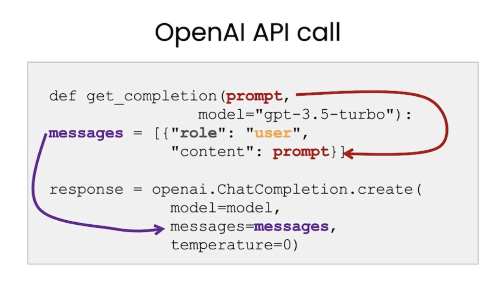
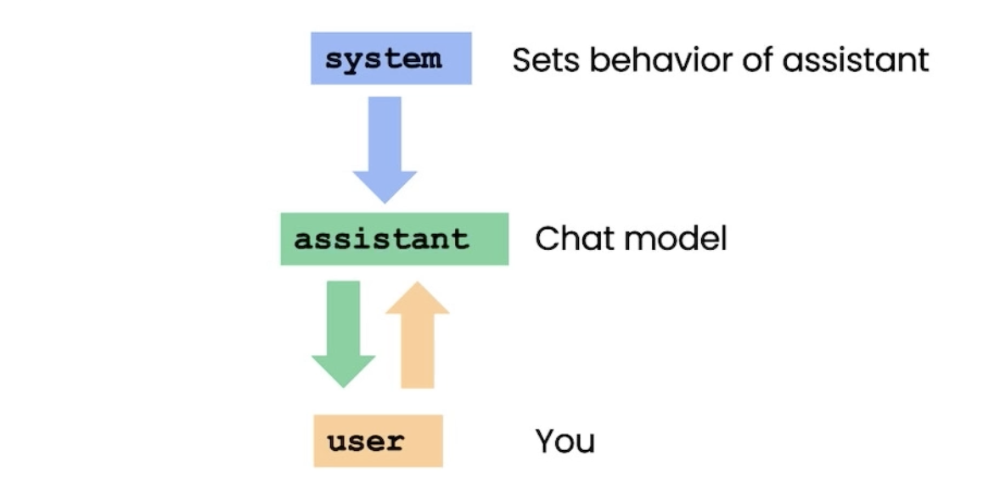
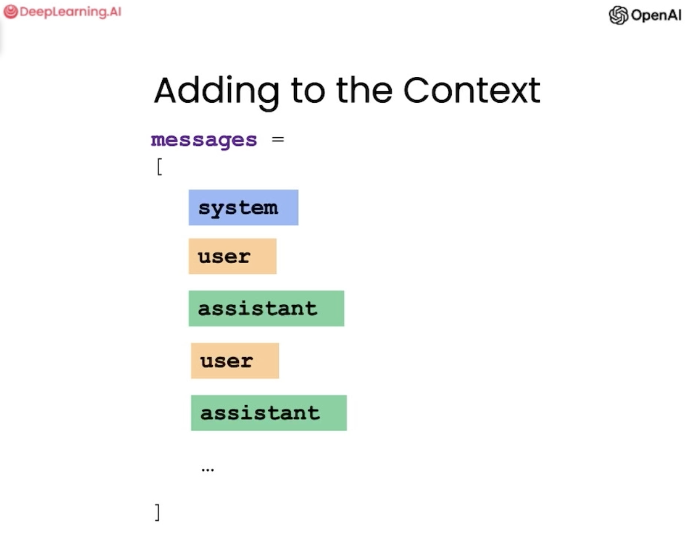
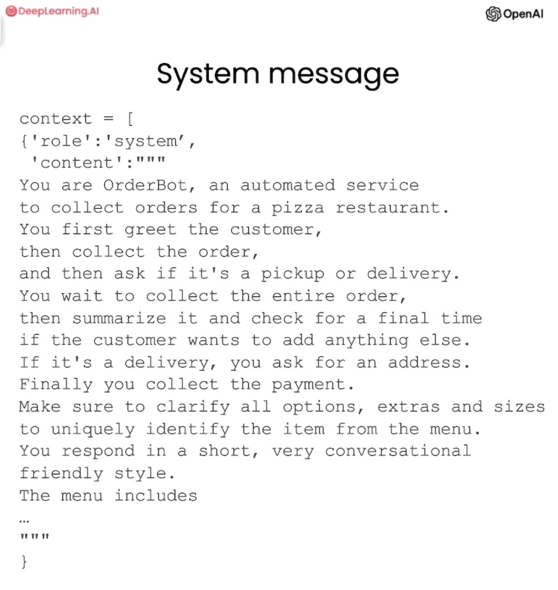

#  8.聊天机器人

---

```{toctree}
:maxdepth: 2
:caption: 目录
```

```
chatgpt prompt：请帮我用中文进行全文翻译下面这段英文，并结构化输出为中文文本段落
```

```
One of the exciting things about a large language model is you can use it to build a custom chatbot with only a modest amount of effort. ChatGPT, the web interface, is a way for you to have a conversational interface, a conversation via a large language model. But one of the cool things is you can also use a large language model to build your custom chatbot to maybe play the role of an AI customer service agent or an AI order taker for a restaurant. 
```

使用大型语言模型的其中一个令人兴奋的方面是，您只需投入适量的努力即可使用它来构建自定义聊天机器人。ChatGPT是一个Web界面，通过它你可以使用大型语言模型进行会话，从而拥有一个交互式的聊天界面。但是，其中的一个很酷的功能是，您也可以使用大型语言模型来构建自定义的聊天机器人，为餐厅扮演AI客户服务代理或AI点餐员等角色。

```
And in this video, you learn how to do that for yourself. I'm going to describe the components of the OpenAI ChatCompletions format in more detail, and then you're going to build a chatbot yourself. So let's get into it. So first, we'll set up the OpenAI Python package as usual. So chat models like ChatGPT are actually trained to take a series of messages as input and return a model-generated message as output. And so although the chat format is designed to make multi-turn conversations like this easy, we've kind of seen through the previous videos that it's also just as useful for single-turn tasks without any conversation.
```

在这个视频中，您将学习如何自己做到这一点。我将更详细地描述OpenAI ChatCompletions格式的组件，然后您将自己构建一个聊天机器人。那么让我们开始吧。首先，我们将像往常一样设置OpenAI Python包。聊天模型（如ChatGPT）实际上是被训练成将一系列消息作为输入，并返回由模型生成的消息作为输出。虽然聊天格式旨在使此类多轮对话变得容易，但我们已经通过以前的视频看到，它对于没有对话的单一任务同样有用。



```
 And so next, we're going to kind of define two helper functions. So this is the one that we've been using throughout all the videos, and it's the getCompletion function. But if you kind of look at it, we give a prompt, but then kind of inside the function, what we're actually doing is putting this prompt into what looks like some kind of user message. And this is because the ChatGPT model is a chat model, which means it's trained to take a series of messages as input and then return a model-generated message as output. So the user message is kind of the input, and then the assistant message is the output.
```

下一步，我们将定义两个辅助函数。第一个是我们在所有视频中都使用的 getCompletion 函数。但是，如果你仔细看一下，我们给出了一个提示，但实际上在函数内部，我们是将这个提示放置到类似用户消息的消息中。这是因为 ChatGPT 模型是一个聊天模型，意味着它被训练成将一系列消息作为输入，然后返回一个由模型生成的消息作为输出。因此，用户消息是输入，而助手消息是输出。 第二个辅助函数是 generateResponse。这个函数将接受一个用户消息，并生成一个 ChatGPT 模型生成的相应助手消息。 通过这两个函数，我们能够与 AIGPT 模型进行交互并生成对话。



```
 So, in this video, we're going to actually use a different helper function, and instead of kind of putting a single prompt as input and getting a single completion, we're going to pass in a list of messages. And these messages can be kind of from a variety of different roles, so I'll describe those. So here's an example of a list of messages. And so, the first message is a system message, which kind of gives an overall instruction, and then after this message, we have kind of turns between the user and the assistant. And this would kind of continue to go on. And if you've ever used ChatGPT, the web interface, then your messages are the user messages, and then ChatGPT's messages are the assistant messages. So the system message helps to kind of set the behaviour and persona of the assistant, and it acts as kind of a high-level instruction for the conversation. 
```

在这个视频中，我们将使用一个不同的辅助函数，而不是像以前一样输入一个单独的提示并获取一个完成结果。我们将传入一个消息列表，这些消息可以来自于不同的角色，我将为您描述一下。以下是一个消息列表的示例。第一条消息是系统消息，用于提供整体指示，然后在此消息之后，我们有用户和助手之间的对话。这个对话可以持续进行下去。如果您曾使用 ChatGPT 的 Web 界面，则您的消息是用户消息，而 ChatGPT 的消息是助手消息。系统消息有助于设置助手的行为和角色，并作为对话的高级指令。

```
So you can kind of think of it as whispering in the assistant's ear and kind of guiding it's responses without the user being aware of the system message. So, as the user, if you've ever used ChatGPT, you probably don't know what's in ChatGPT's system message, and that's kind of the intention. The benefit of the system message is that it provides you, the developer, with a way to kind of frame the conversation without making the request itself part of the conversation. So you can kind of guide the assistant and kind of whisper in its ear and guide its responses without making the user aware. So, now let's try to use these messages in a conversation. So we'll use our new helper function to get the completion from the messages. And we're also using a higher temperature. So the system message says, you are an assistant that speaks like Shakespeare. 
```

您可以将其视为向助手耳语并引导其响应，而用户不会注意到系统消息。所以，作为用户，如果您曾经使用过 ChatGPT，您可能不知道 ChatGPT 的系统消息中包含什么，这也是有意的。系统消息的好处是，它为开发者提供了一种在不使请求本身成为对话一部分的情况下，为对话定框架的方式。因此，您可以在不让用户察觉的情况下引导助手并指导它的回复。现在，让我们尝试使用这些消息来进行对话。我们将使用新的辅助函数从这些消息中获取完成结果。同时，我们还使用了更高的温度。系统消息中说，您是一个像莎士比亚一样说话的助手。 因此，在交互中，我们可以使用这个系统消息来影响助手的回复，从而使对话更加自然流畅，同时又避免在对话中插入明显的提示信息。

```
So this is us kind of describing to the assistant how it should behave. And then the first user message is, tell me a joke. The next is, why did the chicken cross the road? And then the final user message is, I don't know. So if we run this, the response is to get to the other side. Let's try again. To get to the other side, faire so, madame, tis an olden classic that never fails. So there's our Shakespearean response. And let's actually try one more thing, because I want to make it even clearer that this is the assistant message. So here, let's just go and print the entire message response. So, just to make this even clearer, uhm, this response is an assistant message. So, the role is assistant and then the content is the message itself. So, that's what's happening in this helper function. We're just kind of passing out the content of the message. now let's do another example. 
```

这是我们告诉助手它应该如何行事。然后，第一个用户消息是“告诉我一个笑话”。接下来的消息是“为什么小鸡过马路？”最后一个用户消息是“我不知道”。如果我们运行这个程序，响应是“为了到达另一边”。让我们再试一次。为了到达另一边，夫人，请原谅，这是一个永不过时的经典。这就是我们的莎士比亚式回应。让我们再尝试一件事，因为我想让它更清晰，这是助手的消息。因此，让我们将整个消息响应打印出来。为了使这更清晰，这个响应是一条助手消息。因此，角色是助手，内容是消息本身。这就是这个辅助函数中发生的事情。现在让我们做另一个例子。 在这个例子中，我们将使用 getCompletion 函数来发送一条系统消息和一个用户消息，然后获取助手的响应。

```
So, here our messages are, uhm, the assistant message is, you're a friendly chatbot and the first user message is, hi, my name is Isa. And we want to, uhm, get the first user message. So, let's execute this. The first assistant message. And so, the first message is, hello Isa, it's nice to meet you. How can I assist you today? Now, let's try another example. So, here our messages are, uhm, system message, you're a friendly chatbot and the first user message is, yes, can you remind me what is my name? And let's get the response. And as you can see, the model doesn't actually know my name. So, each conversation with a language model is a standalone interaction which means that you must provide all relevant messages for the model to draw from in the current conversation. If you want the model to draw from or, quote unquote, remember earlier parts of a conversation, you must provide the earlier exchanges in the input to the model. And so, we'll refer to this as context.
```

这里，我们的信息有两条，一条是助手的信息：你是一个友好的聊天机器人，另一条信息是用户的第一条反馈：嗨，我的名字是伊莎。我们想要获取用户的第一条信息。所以，让我们执行一下第一条助手信息。第一条反馈是：你好伊莎，很高兴见到你。你今天需要我的帮助吗？现在，让我们尝试另一个例子。这里我们的信息还是有两条，一条是系统信息：你是一个友好的聊天机器人，另一条信息是第一条用户反馈：是的，你能提醒我我的名字是什么吗？我们想要得到回应。然而，你会发现，这个模型实际上还不知道我的名字。所以，每一次与语言模型的交互都是独立的。这意味着，在当前的交互中，你必须提供所有相关的信息，供模型从中获取。如果你想让模型在交互中从先前的对话中获取信息，你必须将之前的对话作为输入提供给模型，我们称之为“上下文”。



```
So, let's try this. So, now we've kind of given the context that the model needs, uhm, which is my name in the previous messages and we'll ask the same question, so we'll ask what my name is. And the model is able to respond because it has all of the context it needs, uhm, in this kind of list of messages that we input to it. So now you're going to build your own chatbot. This chatbot is going to be called orderbot, and we're going to automate the collection of user prompts and assistant responses in order to build this orderbot. And it's going to take orders at a pizza restaurant, so first we're going to define this helper function, and what this is doing is it's going to kind of collect our user messages so we can avoid typing them in by hand in the same, in the way that we did above, and this is going to kind of collect prompts from a user interface that will build below, and then append it to a list called context, and then it will call the model with that context every time. 
```

让我们尝试一下这个。我们已经提供了模型所需的上下文，也就是在之前的信息中提到了我的名字，接下来我们将问同样的问题，询问我的名字。由于模型已经获得了它所需要的所有上下文信息，因此它能够给出回答。现在，你将会建立自己的聊天机器人。这个聊天机器人将被称为“订餐机器人”，我们将使用自动化的方式来收集用户的提示和助手的反馈来构建这个聊天机器人。订餐机器人将用于在一家比萨饼店中接收订单。首先，我们将定义这个“帮助函数”，它将会收集我们的用户消息，以便我们避免手动输入它们。与之前一样，这个函数将从用户界面中收集提示，并将它们附加到一个称为上下文的列表中，然后每次都会使用该上下文来调用模型。

```
And the model response is then also added to the context, so the kind of model message is added to the context, the user message is added to the context, so on, so it just kind of grows longer and longer. This way the model has the information it needs to determine what to do next. And so now we'll set up and run this kind of UI to display the order bot, and so here's the context, and it contains the system message that contains the menu, and note that every time we call the language model we're going to use the same context, and the context is building up over time. And then let's execute this. 
```

模型的回应也会添加到上下文中，也就是说，模型的反馈信息也会添加到上下文中，用户的反馈信息也会添加到上下文中，类似这样，这个上下文会变得越来越长。这样一来，模型就拥有了它所需的信息，来决定下一步该怎么做。现在我们将设置并运行这个用户界面来展示订餐机器人，这里的上下文包含了系统信息，其中包含了菜单。需要注意的是，每次调用语言模型时，我们都将使用相同的上下文，并且上下文会随着时间越来越完整。现在，让我们来执行它。



```
Okay, I'm going to say, hi, I would like to order a pizza. And the assistant says, great, what pizza would you like to order? We have pepperoni, cheese, and eggplant pizza. How much are they? Great, okay, we have the prices. I think I'm feeling a medium eggplant pizza. So as you can imagine, we could kind of continue this conversation, and let's kind of look at what we've put in the system message. So you are order bot, an automated service to collect orders for a pizza restaurant. You first greet the customer, then collect the order, and then ask if it's a pickup or delivery. 
```

好的，我将说“嗨，我想要订一份比萨饼”。然后助手说：“很好，您想订哪种比萨饼？我们有意大利辣肠、奶酪和茄子比萨饼，它们的价格是多少？”好的，我们已经知道了价格。我想我会喜欢一份中号的茄子比萨饼。正如你所想象的那样，我们可以继续这个对话，让我们看一下我们放在系统信息中的内容。“你是订餐机器人，一个收集比萨饼店订单的自动服务。你首先问候顾客，然后收集订单，并询问是否要取货或送货。”

```
You wait to collect the entire order, then summarize it and check for a final time if the customer wants to add anything else. If it's a delivery, you can ask for an address. Finally, you collect the payment. Make sure to clarify all options, extras, and sizes to uniquely identify the item from the menu. You respond in a short, very conversational, friendly style. The menu includes, and then here we have the menu. So let's go back to our conversation and let's see if the assistant kind of has been following the instructions. Okay, great, the assistant asks if we want any toppings which we kind of specified an assistant message. So I think we want no extra toppings. Things... sure thing. Is there anything else we'd like to order? Hmm, let's get some water. Actually, fries. Small or large? 
```

你等待收集整个订单，然后总结，并最后再次确认客户是否需要添加其他内容。如果是送货，你可以询问地址。最后，你收取支付款项。确保澄清所有选项、附加项和规格，以唯一地从菜单中识别出该项目。你以简短、非常口语化和友好的方式回应。菜单包括，然后这里我们有菜单。所以让我们回到我们的对话，看看助手是否遵循了指示。好的，助手问我们是否需要任何配料，这是我们在助手消息中指定的。所以我认为我们不需要额外的配料。其他东西......当然。我们还想再点点水吗？嗯，我们想要薯条。小的还是大的？

```
And this is great because we kind of asked the assistant in the system message to kind of clarify extras and sides. And so you get the idea and please feel free to play with this yourself. You can pause the video and just go ahead and run this in your own notebook on the left. And so now we can ask the model to create a JSON summary that we could send to the order system based on the conversation. So we're now appending another system message which is an instruction and we're saying create a JSON summary of the previous food order, itemize the price for each item, the fields should be one pizza, include side, two lists of toppings, three lists of drinks, and four lists of sides, and finally the total price.
```

这很好，因为我们在系统消息中要求助手澄清了附加项和辅菜。所以你已经有了想法，请随意尝试运行。你可以暂停视频，然后在左侧的笔记本中运行。现在我们可以要求模型创建一个基于对话而创建的可发送到订单系统的JSON摘要。因此，我们现在附加了另一个系统消息，这是一个指示，我们说要为之前的食品订单创建一个JSON摘要，详述每个项目的价格，字段应该是一个比萨、包括辅菜、两个配料列表、三个饮料列表、四个辅菜列表，最后是总价。

```
And you could also use a user message here, this does not have to be a system message. So let's execute this. And notice in this case we're using a lower temperature because for these kinds of tasks we want the output to be fairly predictable. For a conversational agent you might want to use a higher temperature, however in this case I would maybe use a lower temperature as well because for a customer's assistant chatbot you might want the output to be a bit more predictable as well. And so here we have the summary of our order and so we could submit this to the order system if we wanted to. 
```

你也可以在这里使用用户消息，这不一定是一个系统消息。所以让我们执行一下。请注意，在这种情况下，我们使用了一个较低的温度，因为对于这些任务，我们希望输出相当可预测。对于一个会话代理，你可能想要使用一个更高的**温度**，但在这种情况下，我也可能使用一个较低的**温度**，因为对于客户助手聊天机器人，你可能也希望输出看起来更可预测。所以在这里我们有我们订单的摘要，如果我们想的话，我们可以将它提交给订单系统。

```
So there we have it, you've built your very own order chatbot. Feel free to kind of customize it yourself and play around with the system message to kind of change the behavior of the chatbot and kind of get it to act as different personas with different knowledge. 
```

所以我们完成了，你已经建立起了自己的订单聊天机器人。你可以自由地对其进行定制，并玩弄系统消息，以改变聊天机器人的行为，并使其表现为具有不同知识的不同人物。
