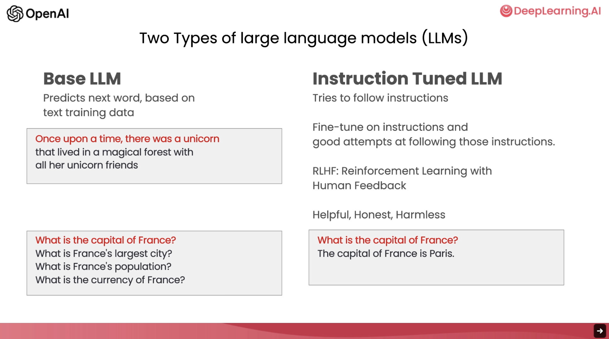
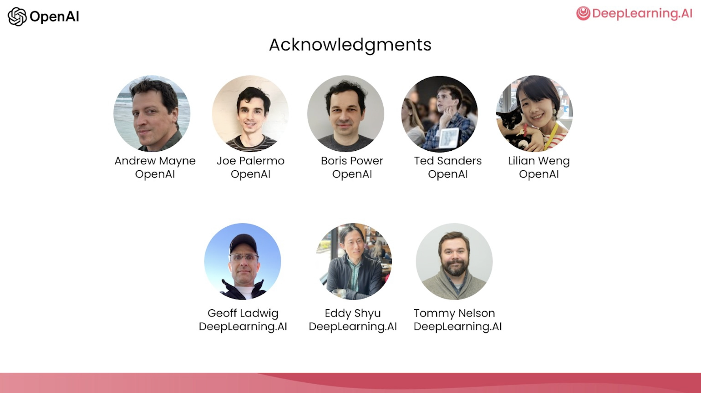

# 1.引言

---

```{toctree}
:maxdepth: 2
:caption: 目录
```

```
chatgpt prompt：请帮我用中文进行全文翻译下面这段英文，并结构化输出为中文文本段落
```

```
Welcome to this course on ChatGPT prompt engineering for developers. I'm thrilled to have with me Isa Fulford to teach this along with me. She is a member of the technical staff of OpenAI and had built the popular ChatGPT retrieval plugin and a large part of the work has been teaching people how to use LLM or large language model technology in products. She's also contributed to the OpenAI cookbook that teaches people prompting. So thrilled to have you with you. And I'm thrilled to be here and share some prompting best practices with you all. So there's been a lot of material on the internet for prompting with articles like 30 prompts everyone has to know A lot of that has been focused on the ChatGPT web user interface Which many people are using to do specific and often one-off tasks But I think the power of LLM large language models as a developer to that is using API calls to LLM To quickly build software applications. I think that is still very underappreciated In fact, my team at AI Fund, which is a sister company to DeepLearning.AI Has been working with many startups on applying these technologies to many different applications And it's been exciting to see what LLM APIs can enable developers to very quickly build So in this course, we'll share with you some of the possibilities for what you can do As well as best practices for how you can do them There's a lot of material to cover. 
```

欢迎来到这门针对开发者的AIGPT提示工程课程。我很高兴能够与Isa Fulford一起授课。她是OpenAI的技术团队成员，她开发了流行的AIGPT检索插件，同时也教授人们如何在产品中使用LLM或大型语言模型技术，也为OpenAI食谱做出贡献。我很高兴能和她一起授课。同时我也很高兴在这里与大家分享一些提示最佳实践。实际上，关于提示已经有了很多互联网上的材料，例如“30个人人都必须知道的提示”。很多焦点都放在了AIGPT的Web版界面上，这使得很多人只用于完成特定的任务，而且经常是一次性的。但我认为，LLM大型语言模型作为一名开发人员的强大之处在于使用API调用LLM快速构建软件应用程序。实际上，AI Fund在我的团队与DeepLearning.AI的姊妹公司合作，为很多创业公司应用这些技术到许多不同的应用领域，看到LLM API可以使开发人员非常快速地构建应用程序实属令人兴奋。因此，在这门课程中，我们将与您分享一些您可以做到什么的可能性，以及如何最佳实践地完成这些任务。有很多要涵盖的内容。



```
First you'll learn some prompting best practices for software development Then we'll cover some common use cases, summarizing, inferring, transforming, expanding And then you'll build a chatbot using an LLM We hope that this will spark your imagination about new applications that you can build So in the development of large language models or LLMs, there have been broadly two types of LLMs Which I'm going to refer to as base LLMs and instruction tuned LLMs 
```

首先，你将学习一些软件开发最佳实践的提示。然后，我们将涵盖一些常见的用例，包括总结、推理、转换和扩展。接着，你将使用LLM构建一个聊天机器人。我们希望这会激发你的想象力，并能够创建出新的应用程序。在大型语言模型或LLM的开发中，大体上有两种类型的LLM，我将其称为基础LLM和指令调整后的LLM。

```
So base OMS has been trained to predict the next word based on text training data Often trained on a large amount of data from the internet and other sources To figure out what's the next most likely word to follow So for example, if you were to prompt this once upon a time there was a unicorn It may complete this, that is it may predict the next several words are That live in a magical forest with all unicorn friends But if you were to prompt this with what is the capital of France 
```

因此，基础LLM已经训练出来根据文本训练数据预测下一个单词。通常是在互联网和其他来源的大量数据上进行训练，以找出接下来最有可能的单词。例如，如果你提示“一次有一个独角兽”，它可能会继续完整这个句子，预测出接下来的几个单词是“和所有的独角兽朋友生活在一个神奇的森林里”。但如果你提示“法国的首都是什么”，那么LLM可能会给出正确的回答“巴黎”，或者可能会给出错误的回答。训练后的LLM可以接收新的提示作为输入，并输出预测结果。

```
Then based on what articles on the internet might have It's quite possible that a base LLMs will complete this with What is France's largest city, what is France's population and so on Because articles on the internet could quite plausibly be lists of quiz questions about the country of France In contrast, an instruction tuned LLMs, which is where a lot of momentum of LLMs research and practice has been going An instruction tuned LLMs has been trained to follow instructions So if you were to ask it, what is the capital of France is much more likely to output something like the capital of France is Paris 
```

基于互联网上的文章，基础LLM有可能会回答法国的最大城市是什么，法国的人口是多少等等。因为互联网上的文章很可能是关于法国的问答列表。相比之下，指令调整后的LLM更接受人们的指令。因此，如果你问它法国的首都是什么，它很可能会输出法国的首都是巴黎。指令调整后的LLM的研究和实践的动量更大。

```
So the way that instruction tuned LLMs are typically trained is You start off with a base LLMs that's been trained on a huge amount of text data And further train it for the fine tune it with inputs and outputs that are instructions and good attempts to follow those instructions And then often further refine using a technique called RLHF reinforcement learning from human feedback To make the system better able to be helpful and follow instructions Because instruction tuned LLMs have been trained to be helpful, honest and harmless So for example, they're less likely to output problematic text such as toxic outputs compared to base LLMs A lot of the practical usage scenarios have been shifting toward instruction tuned LLMs Some of the best practices you find on the internet may be more suited for a base LLMs 
```

因此，指令调整后的LLM通常是这样训练的：首先，你从大量文本数据中训练出一个基础LLM，随后使用指令和良好尝试的输入和输出来对其进行微调和优化，然后通常使用称为“人类反馈强化学习”的技术进行进一步细化，以使系统更能够有帮助且能够遵循指令。因为指令调整后的LLM被训练成有用、诚实和无害的，所以它们输出有害文本（如毒性输出）的可能性比基础LLM更小。很多实际的应用场景已开始向指令调整后的LLM转移，而一些在互联网上查到的最佳实践则可能更适用于基础LLM。

```
But for most practical applications today, we would recommend most people instead focus on instruction tuned LLMs Which are easier to use and also because of the work of OpenAI and other LLM companies becoming safer and more aligned So this course will focus on best practices for instruction tuned LLMs Which is what we recommend you use for most of your applications Before moving on, I just want to acknowledge the team from OpenAI and DeepLearning.ai that had contributed to the materials That Izzy and I will be presenting. I'm very grateful to Andrew Main, Joe Palermo, Boris Power, Ted Sanders, and Lillian Weng from OpenAI They were very involved with us brainstorming materials, vetting the materials to put together the curriculum for this short course And I'm also grateful on the deep learning side for the work of Geoff Ladwig, Eddy Shyu, and Tommy Nelson
```

对于大多数今天的实际应用，我们建议大多数人应该专注于经过调整的指令语言模型。这些模型更易于使用，而且由于OpenAI和其他LLM公司的工作，它们变得更加安全和更加符合要求。因此，本课程将专注于经过调整的指令语言模型的最佳实践，这是我们建议大多数应用程序使用的模型。在继续之前，我只想感谢OpenAI和DeepLearning.ai团队为我们提供的材料做出的贡献。我非常感谢OpenAI的Andrew Main、Joe Palermo、Boris Power、Ted Sanders和Lillian Weng。他们与我们一起进行了头脑风暴，对材料进行了审核，为这个短期课程的课程设置拼凑了课程计划。我也感谢深度学习方面Geoff Ladwig、Eddy Shyu和Tommy Nelson的工作。



```
So when you use an instruction tuned LLMs, think of giving instructions to another person Say someone that's smart but doesn't know the specifics of your task So when an LLMs doesn't work, sometimes it's because the instructions weren't clear enough For example, if you were to say, please write me something about Alan Turing Well, in addition to that, it can be helpful to be clear about whether you want the text to focus on his scientific work Or his personal life or his role in history or something else And if you specify what you want the tone of the text to be, should it take on the tone like a professional journalist would write? Or is it more of a casual note that you dash off to a friend that hopes the OMS generate what you want? And of course, if you picture yourself asking, say, a fresh college graduate to carry out this task for you If you can even specify what snippets of text they should read in advance to write this text about Alan Turing Then that even better sets up that fresh college grad for success to carry out this task for you So in the next video, you see examples of how to be clear and specific, which is an important principle of prompting OMS And you also learn from either a second principle of prompting that is giving LLM time to think So with that, let's go on to the next video 
```

因此，当您使用经过调整的指令语言模型时，请考虑给另一个人指示。比如说一个聪明但不了解任务细节的人。那么当LLMs不能工作时，有时是因为指令不够清晰。例如，如果您要说，请为我写一些关于艾伦·图灵的东西。除此之外，明确您希望文本集中讨论他的科学工作、个人生活、在历史中的角色或其他相关事项可能会有所帮助。如果您指定文本要呈现的语气，它应该采用类似专业新闻记者所写的语气呢？还是更像一封简短的随笔，希望LLMs生成您所要求的内容？当然，如果你想象自己要求一个刚拿到大学毕业证的人为你执行这个任务，你甚至可以提前指定他们应该阅读哪几段文本以撰写关于艾伦·图灵的文本，这会进一步为他们成功执行您的此项任务做好准备。在下一个视频中，您将看到如何清晰明确、具体，这是提示LLMs的一个重要原则。您还将学习第二个提示原则：给LLMs时间思考。所以，让我们继续下一个视频。
